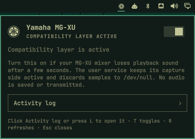
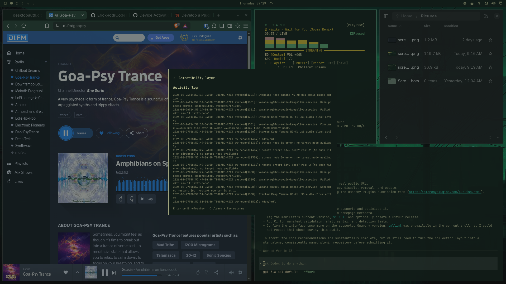
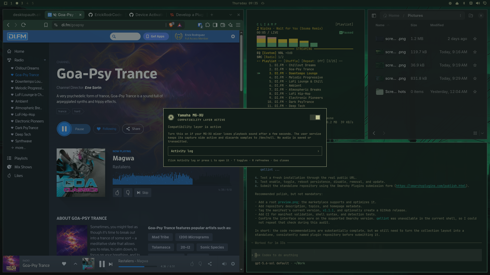

# Yamaha MG-XU Compatibility

An Omarchy bar widget and launcher app by Erick Rodriguez for Yamaha MG10XU/MG-XU mixers that lose playback sound after a few seconds. Turn the compatibility layer on when playback starts normally and then becomes silent even though PipeWire still shows it as active.

The workaround runs a user-level service that reads the Yamaha capture source and sends every sample to `/dev/null`. Nothing is recorded, retained, or transmitted.

The Yamaha badge follows the active Omarchy theme: normal foreground means the compatibility layer is active, while the standard dimmed treatment means it is off. Left-click opens the panel; right-click has no action, preventing accidental activation. The panel's Activity log subpanel shows recent service starts, stops, restarts, and errors from the systemd user journal.

## Install

```bash
omarchy plugin add https://github.com/ErickRodrCodes/yamaha-mg10xu-compat.git --enable
~/.config/omarchy/plugins/io.github.tbogard.yamaha-mg-xu/scripts/install-app.sh
```

The launcher appears as **Yamaha MG-XU Compatibility** in the application menu. It opens an Omarchy overlay inside the existing shell process; it does not launch a second Quickshell instance.

## Screenshots







## Requirements

- Omarchy `4.0.1-1` (tested version)
- Yamaha MG10XU/MG-XU visible to PipeWire
- PipeWire tools (`pw-record`, `pw-dump`, `wpctl`) and `jq`
- systemd user services

The plugin runs with your user permissions. It uses no root privileges and depends on `pw-record`, `pw-dump`, `wpctl`, `jq`, and a systemd user session. Enabling it installs and starts `~/.config/systemd/user/yamaha-mg10xu-audio-keepalive.service`.

## Safety

- Never runs `sudo`, `pkexec`, a second Quickshell process, or remote code.
- Never edits packaged files under `/usr/share/omarchy`.
- Writes only its exact systemd user-unit path and refuses path-like unit names.
- The optional app installer writes only `~/.local/share/applications/io.github.tbogard.yamaha-mg-xu.desktop` and `~/.local/share/icons/hicolor/scalable/apps/io.github.tbogard.yamaha-mg-xu.svg`; it refuses unrelated collisions.
- Writes one clear-view timestamp under `~/.local/state/yamaha-mg-xu-compat/`; it never deletes the system journal.
- Refuses to overwrite or remove a unit unless it contains this plugin's ownership marker.
- Validates the PipeWire source name before placing it in the service definition.
- Detects an MG-XU capture node from Yamaha's USB vendor ID (`0499`) and the MG-XU family name; it does not require a particular product ID such as `1703`.
- Refuses to enable the layer when no matching device is present or when multiple matches make selection ambiguous.
- Rolls back the installed file if systemd cannot activate the service.
- Runs `pw-record` with `NoNewPrivileges`, realtime and set-user-ID restrictions, a native-only system-call architecture, and a private file-creation mask. Filesystem/device namespace restrictions are intentionally avoided because they can prevent PipeWire client connections on affected systems.
- Continuously discards capture samples to `/dev/null`; it does not save or transmit them.

## Usage

If your MG-XU mixer loses sound after a few seconds, click the Yamaha badge or launch **Yamaha MG-XU Compatibility**, then turn the compatibility layer on. Both surfaces use the same controller and `CompatibilityView.qml`, so status, actions, and activity history stay synchronized. Turn it off when the workaround is not needed. Press `T` or Enter to toggle, `L` for activity, `C` to clear the activity view, `R` to refresh, and Escape to close or go back. You can also use:

```bash
scripts/status.sh
scripts/activity-log.sh
scripts/install.sh --dry-run
scripts/install.sh
scripts/uninstall.sh --dry-run
scripts/uninstall.sh
scripts/install-app.sh
scripts/uninstall-app.sh
```

The capture source is discovered from live PipeWire metadata, so PipeWire naming changes and Yamaha product IDs other than `1703` do not require configuration. If more than one MG-XU capture source is connected, set `YAMAHA_SOURCE` to the exact node name you want to use.

## How it works

Omarchy's audio panel creates a `PwNodePeakMonitor` for the default input while the panel is open. On an affected MG-XU, that capture activity keeps the USB duplex clock moving and playback audible. The service reproduces only that keepalive behavior without requiring the panel to remain open.

## Validate

```bash
omarchy plugin validate .
qmllint -I "$OMARCHY_PATH/shell" BarWidget.qml Panel.qml
tests/detection.sh
```

## Remove

Turn the compatibility layer off first, then remove the widget:

```bash
scripts/uninstall.sh
scripts/uninstall-app.sh
omarchy plugin remove io.github.tbogard.yamaha-mg-xu
```

Press `C` in the Activity log to clear its view. This records a timestamp in `~/.local/state/yamaha-mg-xu-compat/activity-cleared-at`; it does not delete entries from the shared system journal.

The plugin never edits `/usr/share/omarchy`.
